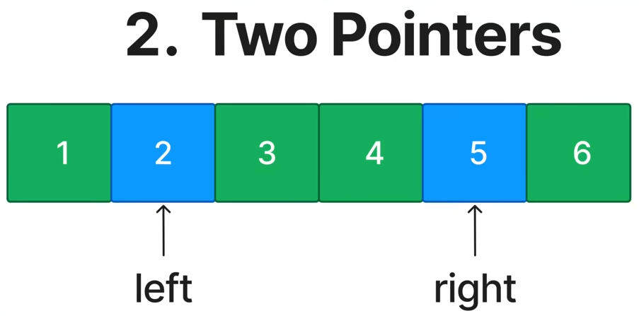
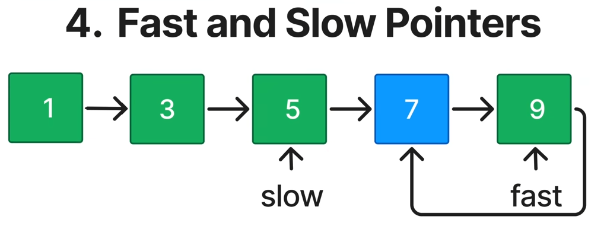
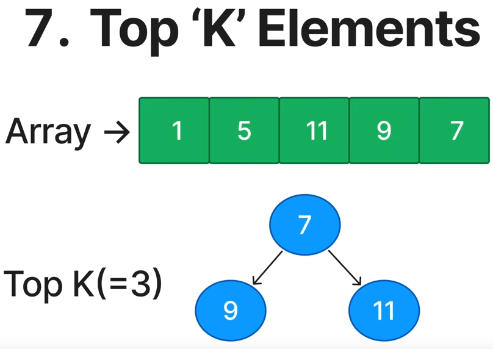
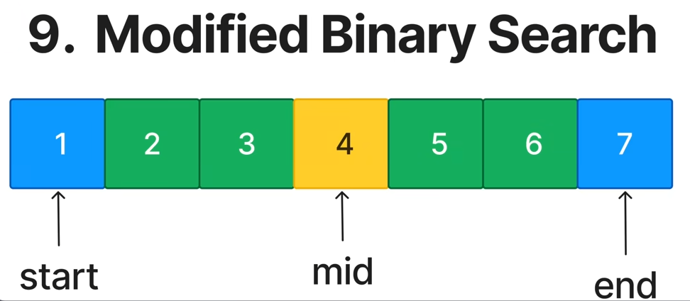
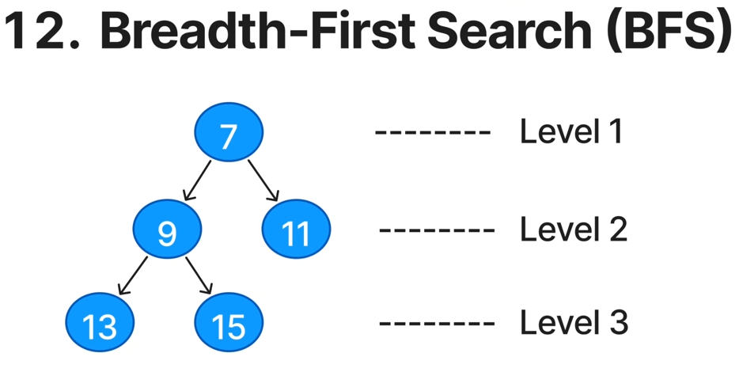
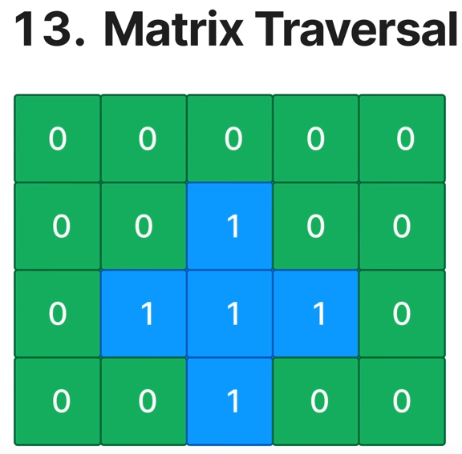

# [Common Patterns](/CommonPatterns.md)

### [Prefix Sum](/PrefixSum.md)

### [Two Pointer](/TwoPointers.md)

### [Sliding Window](/SlidingWindows.md)

### [Fast & Slow Pointer](/FastAndSlowPointers.md)

### [Linked List In-Place Reversal](/LinkedListInPlaceReversal.md)

### [Monotonic Stack](/MonotonicStack.md)

### [Top 'k' Elements](/TopKElement.md)

### [Overlapping Intervals](/OverlappingIntervals.md)

### [Modified Binary Search](/ModifiedBinarySearch.md)

### [Depth-First Search(DFS)](/DepthFirstSearch.md)

### [Breadth-First Search(BFS)](/BreadthFirstSearch.md)

### [Matrix Traversal](/MatrixTraversal.md)

### [Backtracking](/Backtracking.md)

### [Dynamic Programming](/DynamicProgramming.md)

