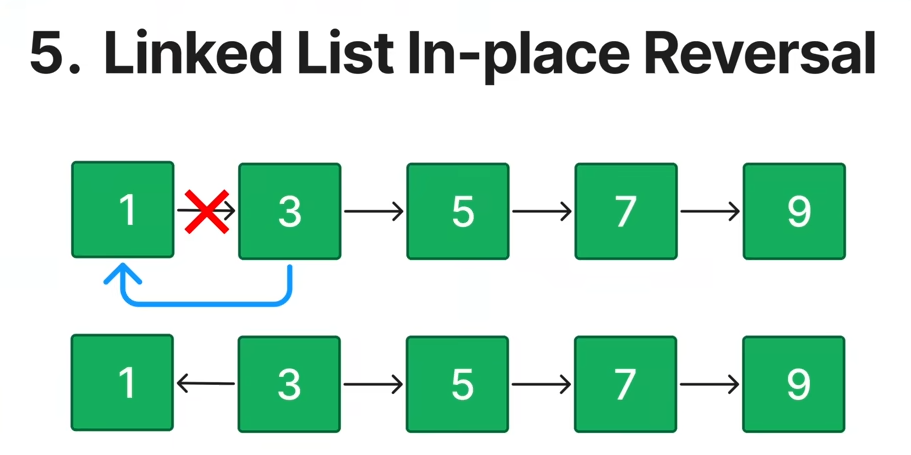
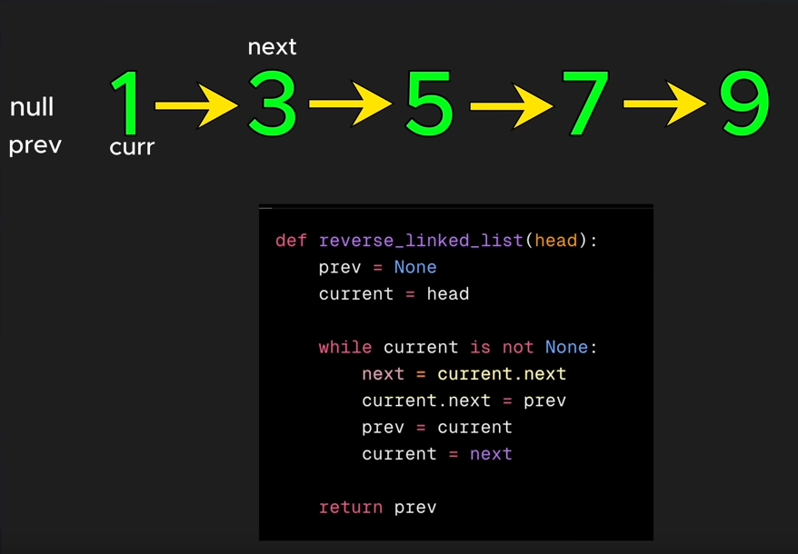
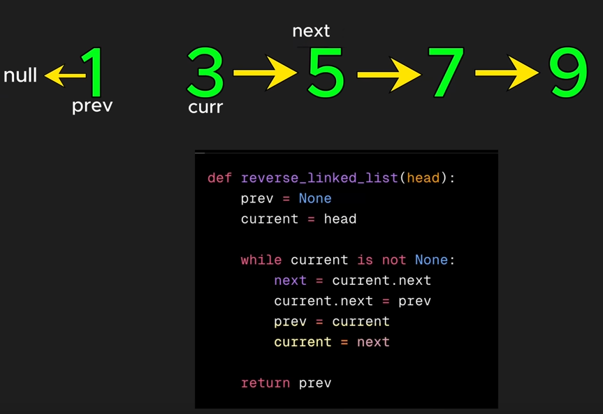
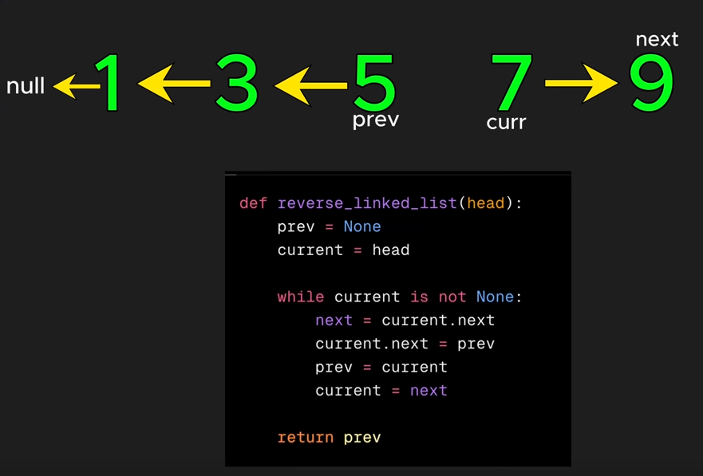

## [CommonPatterns](./CommonPatterns.md) - Linked-List In-place Reversal
- Rearrange the links between nodes of a linked list

206. Reverse Linked List
92. Reverse Linked List II
24. Swap Nodes in Pairs
