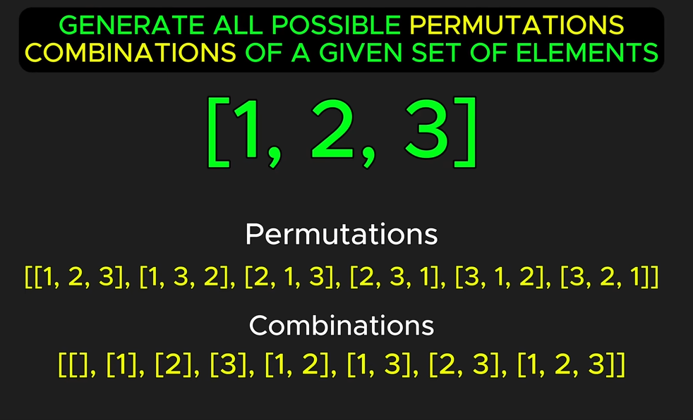
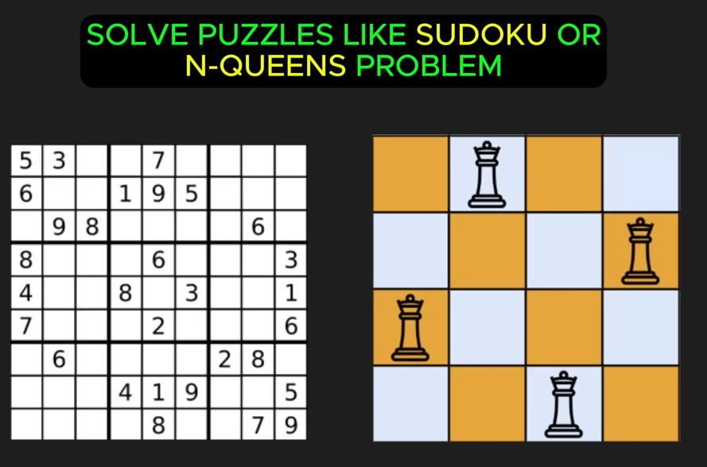
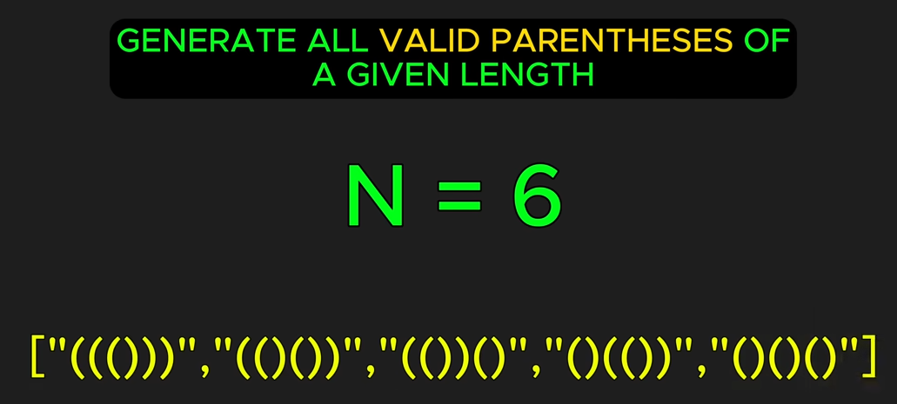
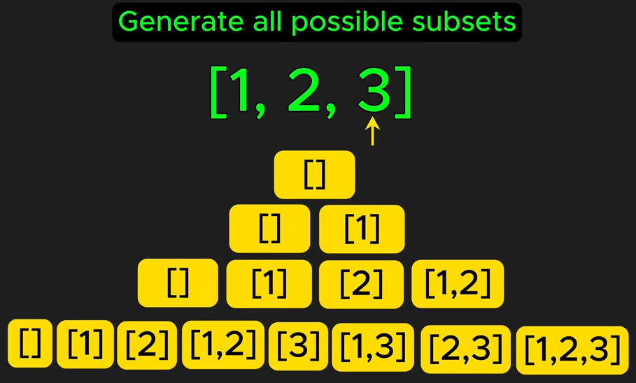

## [CommonPatterns](./CommonPatterns.md) - Backtracking
- Exploring all potential solution paths and backtracking the paths that do not lead to a valid solution

46. Permutations
78. Subsets
51. N-Queens