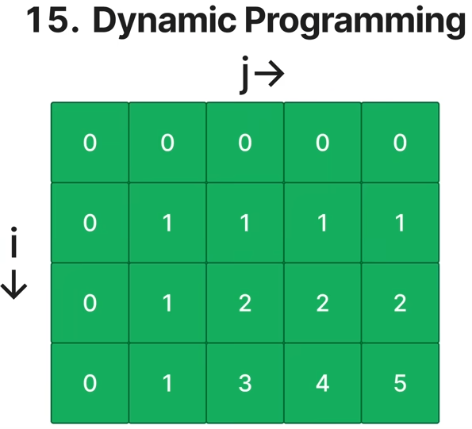
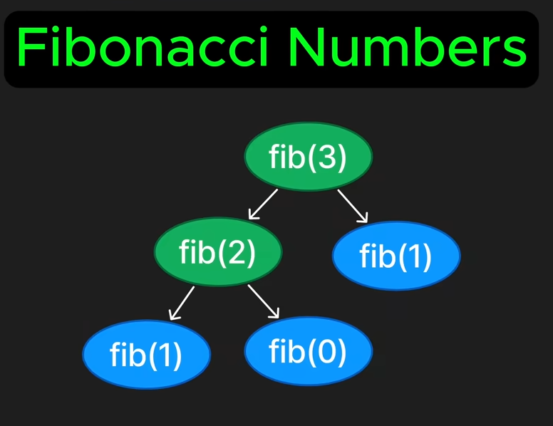
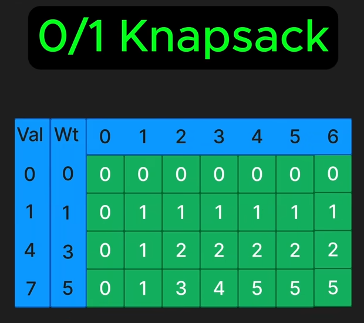
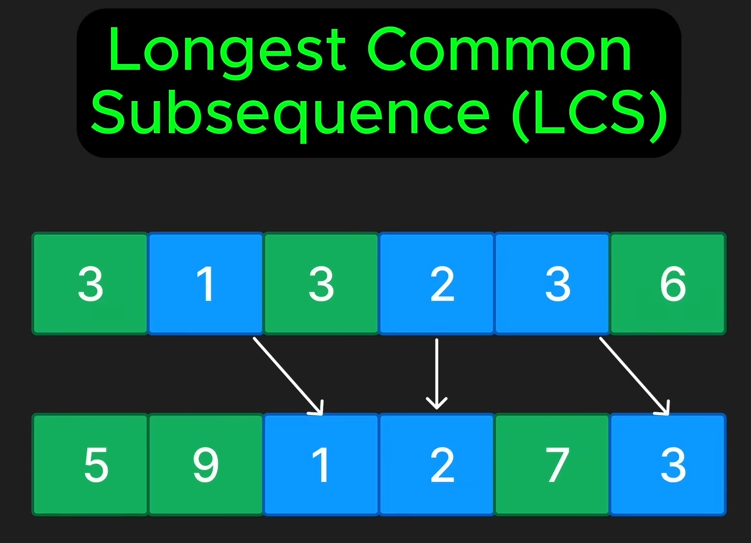
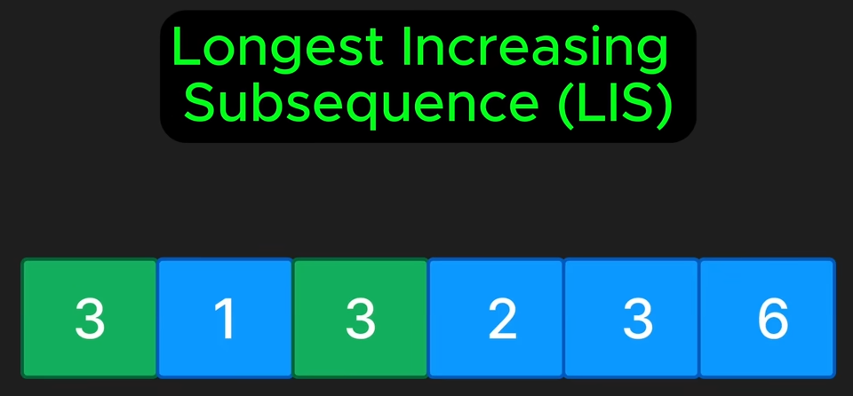
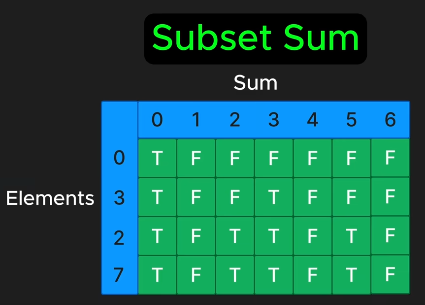

## [CommonPatterns](./CommonPatterns.md) - Dynamic Programming
- Solving optimization problems by breaking them down into smaller sub-problems and storing their solutions to avoid repetitive work
    - Overlapping subproblems
    - Optimal substructure
    - Max/Min a certain value
    - Count number of ways

70. Climbing Stairs
332. Coin Change
1143. Longest Common Subsequence
300. Longest Increasing subsequence
416. Partition Equals Subset Sum
312. Burst Balloons