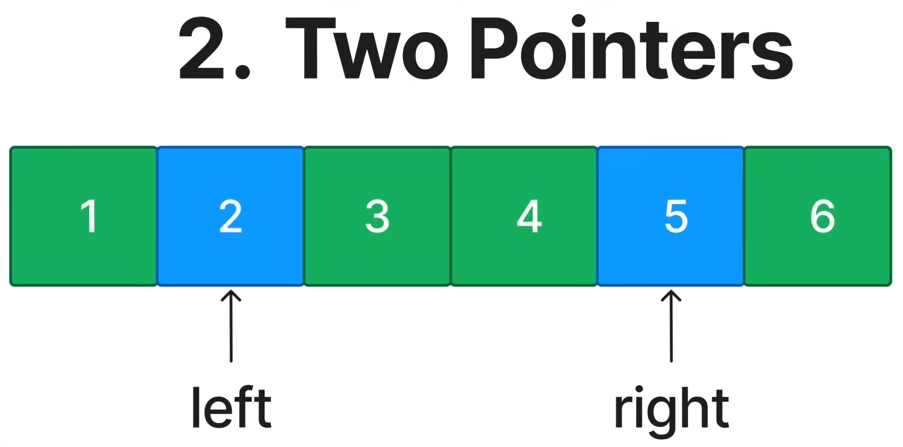
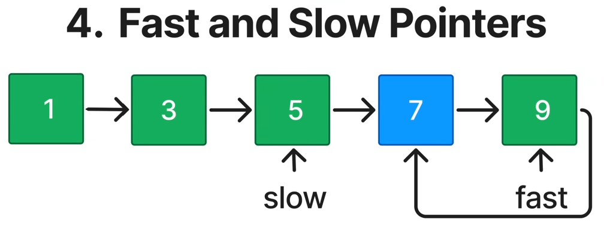
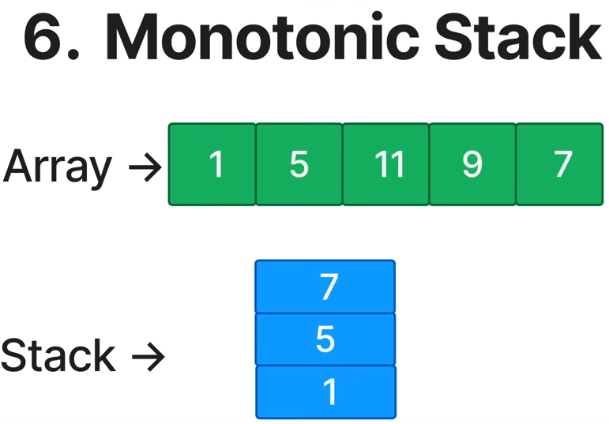
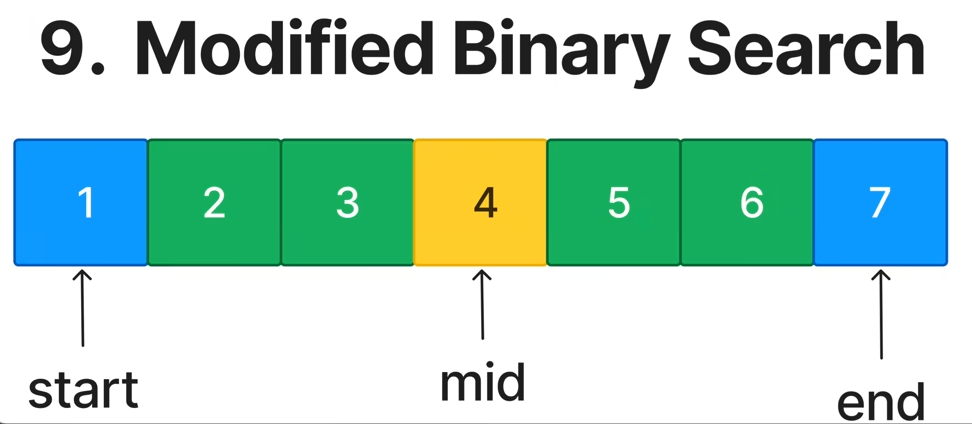
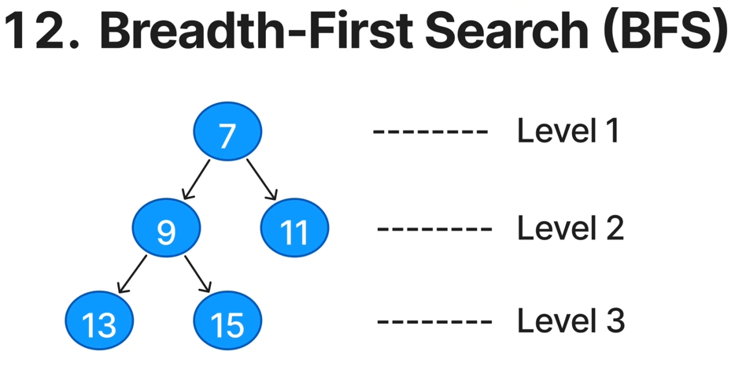
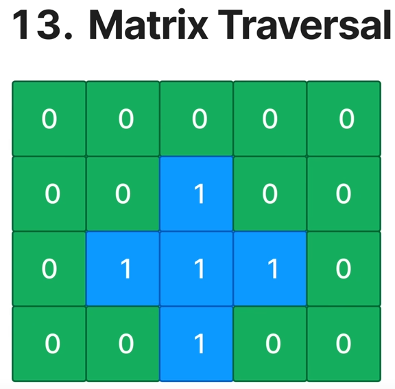

# DataStructuresAndAlgorithm

## Data Structures
| Linear        | Non-Linear |
| --------      | -------    |
| Arrays        | Trees      |
| Linked-List   | BST        |
| Stacks        | Heaps      |
| Queues        | Graphs     |
| Hash Tables   | Trie       |
|               | Union-Find |

## Algorithms
- Sorting
- Binary Search
- Bit Manipulation
- [In-Order / Pre-Order / Post-Order / Level-Order](/BinaryTreeTraversal.md)
- [DFS](/DepthFirstSearch.md) / [BFS](/BreadthFirstSearch.md)
- Toplogical Sort
- Dijkstra
- Bellman Ford

## Problem-Solving Techniques
- [Two Pointers](/TwoPointers.md)
- [Sliding Window](/SlidingWindows.md)
- [Prefix Sum](/PrefixSum.md)
- [Fast and Slow Pointers](/FastAndSlowPointers.md)
- Divide & Conquer
- Greedy
- Recursion
- [Backtracking](/Backtracking.md)
- [Dynamic Programming](/DynamicProgramming.md)
- [Top 'K' Elements](/TopKElement.md)

## Common Patterns

### [Prefix Sum](/PrefixSum.md)

### [Two Pointer](/TwoPointers.md)

### [Sliding Window](/SlidingWindows.md)

### [Fast & Slow Pointer](/FastAndSlowPointers.md)

### [Linked List In-Place Reversal](/LinkedListInPlaceReversal.md)

### [Monotonic Stack](/MonotonicStack.md)

### [Top 'k' Elements](/TopKElement.md)

### [Overlapping Intervals](/OverlappingIntervals.md)

### [Modified Binary Search](/ModifiedBinarySearch.md)

### [Depth-First Search(DFS)](/DepthFirstSearch.md)

### [Breadth-First Search(BFS)](/BreadthFirstSearch.md)

### [Matrix Traversal](/MatrixTraversal.md)

### [Backtracking](/Backtracking.md)

### [Dynamic Programming](/DynamicProgramming.md)

