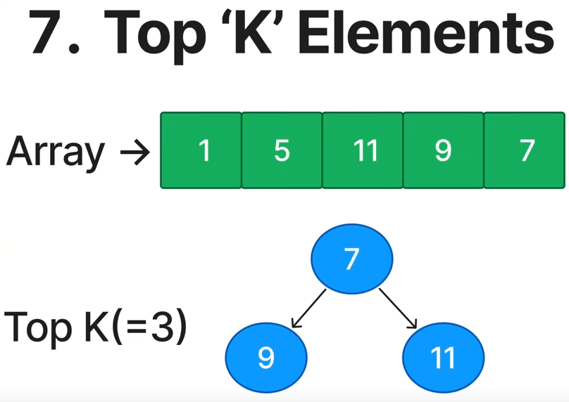

## [CommonPatterns](/README.md#common-patterns) - Top 'k' Elements
- Find 'K' largest / smallest / most common in a dataset
    - K Largest -> Min-Heap
    - K Smallest -> Max-Heap

215. Kth Largest Element in an Array
347. Top K Frequent Elements
373. Find K Pairs with Smallest Sumbs
